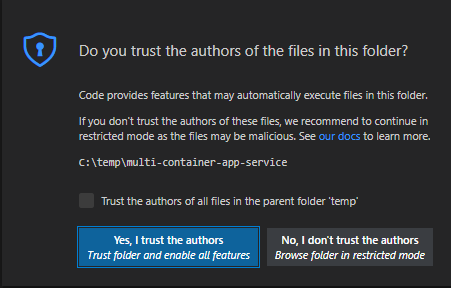
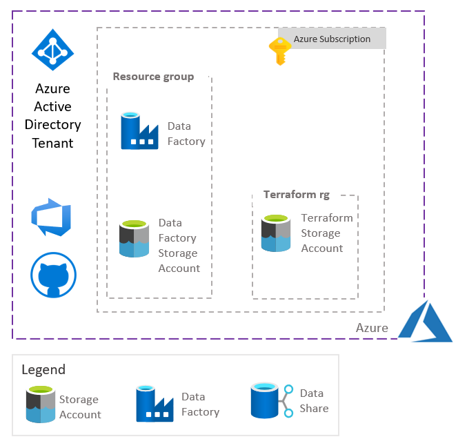
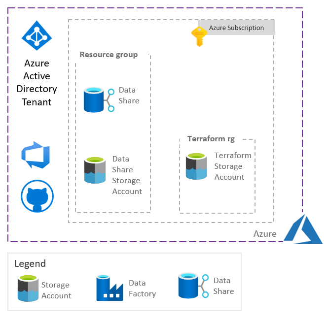

# Deploying Azure Data Factory and Azure Data Share with Terraform
# Table of Contents
- [Deploying Azure Data Factory and Azure Data Share with Terraform](#deploying-azure-data-factory-and-azure-data-share-with-terraform)
- [Table of Contents](#table-of-contents)
  - [Introduction](#introduction)
  - [Installing the pre-requisites](#installing-the-pre-requisites)
    - [Installing Git](#installing-git)
    - [Installing Docker and Visual Studio Code](#installing-docker-and-visual-studio-code)
  - [Installing the project](#installing-the-project)
    - [Clone the repository](#clone-the-repository)
    - [Launch Visual Studio Code with the dev container](#launch-visual-studio-code-with-the-dev-container)
  - [Deploying Azure Data Factory](#deploying-azure-data-factory)
  - [Deploying Azure Data Share](#deploying-azure-data-share)
    - [Testing Azure Data Factory](#testing-azure-data-factory)
    - [Testing Azure Data Share](#testing-azure-data-share)
  - [Next steps](#next-steps)

## Introduction

This sample will show how to deploy Azure Data Share and Azure Data Factory with Terraform.

## Installing the pre-requisites

In order to deploy and test this solution we recommend to use Docker, Visual Studio Code with a dev container.
This chapter describes how to install Git, Docker, Terraform and Visual Studio Code on Windows, MacOS and Linux.

### Installing Git

Git client will be required to clone the repository on your local machine. Git client can installed on Windows, MacOS, Linux.

[Installing Git on several platform](https://git-scm.com/book/en/v2/Getting-Started-Installing-Git)
### Installing Docker and Visual Studio Code

|[](https://www.docker.com/products/docker-desktop)|[](https://docs.docker.com/get-docker/)|[](https://www.docker.com/products/docker-desktop)|
| :--- | :--- | :--- |
| [Docker Desktop](https://www.docker.com/products/docker-desktop) 2.0+ on Windows 10 Pro/Enterprise. Windows 10 Home (2004+) requires Docker Desktop 2.3+ and the [WSL 2 back-end](https://docs.docker.com/desktop/windows/wsl/). (Docker Toolbox is not supported. Windows container images are not supported.) <br />[Visual Studio Code](https://code.visualstudio.com/docs/setup/windows)|  [Docker CE/EE](https://docs.docker.com/get-docker/) 18.06+ and [Docker Compose](https://docs.docker.com/compose/install/) 1.21+. (The Ubuntu snap package is not supported.) <br />[Visual Studio Code](https://code.visualstudio.com/docs/setup/linux) &nbsp;&nbsp; &nbsp;&nbsp; &nbsp;&nbsp; &nbsp;&nbsp; &nbsp;&nbsp; &nbsp;&nbsp; &nbsp;&nbsp; &nbsp;&nbsp; &nbsp;&nbsp; &nbsp;&nbsp; &nbsp;&nbsp; &nbsp;&nbsp; &nbsp;&nbsp; &nbsp;&nbsp; &nbsp;&nbsp; &nbsp;&nbsp; &nbsp;&nbsp; &nbsp;&nbsp; &nbsp;&nbsp; &nbsp;&nbsp; &nbsp;&nbsp; &nbsp;&nbsp; &nbsp; &nbsp;&nbsp; &nbsp;&nbsp; &nbsp;&nbsp; &nbsp;&nbsp; &nbsp;&nbsp; &nbsp;&nbsp; &nbsp;&nbsp; &nbsp;&nbsp; &nbsp;&nbsp; &nbsp;&nbsp; &nbsp;&nbsp; &nbsp;&nbsp; &nbsp;&nbsp; &nbsp;&nbsp; &nbsp;&nbsp; &nbsp;&nbsp; &nbsp;&nbsp; &nbsp;&nbsp; &nbsp;&nbsp; &nbsp;&nbsp; &nbsp;&nbsp; &nbsp;&nbsp; &nbsp;&nbsp; &nbsp;&nbsp; &nbsp;&nbsp; &nbsp;&nbsp; &nbsp;&nbsp; &nbsp;&nbsp; &nbsp;&nbsp; &nbsp;&nbsp; &nbsp;&nbsp; &nbsp;&nbsp; &nbsp;&nbsp; &nbsp;&nbsp; &nbsp;&nbsp; &nbsp;&nbsp; &nbsp;&nbsp; &nbsp; &nbsp;&nbsp; &nbsp;&nbsp; &nbsp;&nbsp; &nbsp;&nbsp; &nbsp;&nbsp; &nbsp;&nbsp; &nbsp;&nbsp; &nbsp;&nbsp; &nbsp;&nbsp; &nbsp;&nbsp; &nbsp;&nbsp; &nbsp;&nbsp; &nbsp;&nbsp; &nbsp;&nbsp; &nbsp;&nbsp; &nbsp;&nbsp; &nbsp;&nbsp; &nbsp;&nbsp; &nbsp;&nbsp; &nbsp;&nbsp; &nbsp;&nbsp; &nbsp;&nbsp; &nbsp;&nbsp; &nbsp;&nbsp; &nbsp;&nbsp; &nbsp;&nbsp; &nbsp;&nbsp; &nbsp;&nbsp; &nbsp;&nbsp; &nbsp;&nbsp; &nbsp;&nbsp; &nbsp;&nbsp; &nbsp;&nbsp; &nbsp;&nbsp; &nbsp;&nbsp; &nbsp;&nbsp; &nbsp;&nbsp; &nbsp; &nbsp;&nbsp; &nbsp;&nbsp; &nbsp;&nbsp; &nbsp;&nbsp; &nbsp;&nbsp; &nbsp;&nbsp; &nbsp;&nbsp; &nbsp;&nbsp; &nbsp;&nbsp; &nbsp;&nbsp; &nbsp;&nbsp; &nbsp;&nbsp; &nbsp;&nbsp; &nbsp;&nbsp; &nbsp;&nbsp; &nbsp;&nbsp; &nbsp;&nbsp; &nbsp;&nbsp; &nbsp;&nbsp; &nbsp;&nbsp; &nbsp;&nbsp; &nbsp;&nbsp; &nbsp;&nbsp;    | [Docker Desktop](https://www.docker.com/products/docker-desktop) 2.0+. <br />[Visual Studio Code](https://code.visualstudio.com/docs/setup/mac) &nbsp;&nbsp; &nbsp;&nbsp; &nbsp;&nbsp; &nbsp;&nbsp; &nbsp;&nbsp; &nbsp;&nbsp; &nbsp;&nbsp; &nbsp;&nbsp; &nbsp;&nbsp; &nbsp;&nbsp; &nbsp;&nbsp; &nbsp;&nbsp; &nbsp;&nbsp; &nbsp;&nbsp; &nbsp;&nbsp; &nbsp;&nbsp; &nbsp;&nbsp; &nbsp;&nbsp; &nbsp;&nbsp; &nbsp;&nbsp; &nbsp;&nbsp; &nbsp;&nbsp; &nbsp; &nbsp;&nbsp; &nbsp;&nbsp; &nbsp;&nbsp; &nbsp;&nbsp; &nbsp;&nbsp; &nbsp;&nbsp; &nbsp;&nbsp; &nbsp;&nbsp; &nbsp;&nbsp; &nbsp;&nbsp; &nbsp;&nbsp; &nbsp;&nbsp; &nbsp;&nbsp; &nbsp;&nbsp; &nbsp;&nbsp; &nbsp;&nbsp; &nbsp;&nbsp; &nbsp;&nbsp; &nbsp;&nbsp; &nbsp;&nbsp; &nbsp;&nbsp; &nbsp;&nbsp; &nbsp;&nbsp; &nbsp;&nbsp; &nbsp;&nbsp; &nbsp;&nbsp; &nbsp;&nbsp; &nbsp;&nbsp; &nbsp;&nbsp; &nbsp;&nbsp; &nbsp;&nbsp; &nbsp;&nbsp; &nbsp;&nbsp; &nbsp;&nbsp; &nbsp;&nbsp; &nbsp;&nbsp; &nbsp;&nbsp; &nbsp; &nbsp;&nbsp; &nbsp;&nbsp; &nbsp;&nbsp; &nbsp;&nbsp; &nbsp;&nbsp; &nbsp;&nbsp; &nbsp;&nbsp; &nbsp;&nbsp; &nbsp;&nbsp; &nbsp;&nbsp; &nbsp;&nbsp; &nbsp;&nbsp; &nbsp;&nbsp; &nbsp;&nbsp; &nbsp;&nbsp; &nbsp;&nbsp; &nbsp;&nbsp; &nbsp;&nbsp; &nbsp;&nbsp; &nbsp;&nbsp; &nbsp;&nbsp; &nbsp;&nbsp; &nbsp;&nbsp; &nbsp;&nbsp; &nbsp;&nbsp; &nbsp;&nbsp; &nbsp;&nbsp; &nbsp;&nbsp; &nbsp;&nbsp; &nbsp;&nbsp; &nbsp;&nbsp; &nbsp;&nbsp; &nbsp;&nbsp; &nbsp;&nbsp; &nbsp;&nbsp; &nbsp;&nbsp; &nbsp;&nbsp; &nbsp; &nbsp;&nbsp; &nbsp;&nbsp; &nbsp;&nbsp; &nbsp;&nbsp; &nbsp;&nbsp; &nbsp;&nbsp; &nbsp;&nbsp; &nbsp;&nbsp; &nbsp;&nbsp; &nbsp;&nbsp; &nbsp;&nbsp; &nbsp;&nbsp; &nbsp;&nbsp; &nbsp;&nbsp; &nbsp;&nbsp;  |

## Installing the project

### Clone the repository

For you local machine running Windows or MacOS or Linux, open a Terminal and run the following command. 

1. Create a directory to copy the repository

      mkdir myproject

      cd myproject

2. Clone the repository

      git clone https://CSECodeHub@dev.azure.com/CSECodeHub/409271%20-%20Bertelsmann%20-%20Global%20Data%20Platform/_git/terraform-data-factory-data-share

### Launch Visual Studio Code with the dev container

1. In the same terminal, navigate to the project folder

      cd terraform-data-factory-data-share

2. Launch Visual Studio Code from your terminal with the following command:

      code .

3. A first dialog box will appear asking the question "Do you trust the authors of the files in this folder?", click on the Yes button.

    

4. A second dialog box will appear asking whether you want to open the project with a dev container. Click on the button "reopen in container"

    

5. Visual Studio Code will build the dev container. After few minutes, the dev container has been built, you you can open a shell running on this dev container

    

6. Select the sub menu "New Terminal" in the menu "Terminal".

    

7. Select the sub menu "New Terminal" in the menu "Terminal". The Terminal appears, and you can use linux shell commands like "ls -l"

    

8. You are now ready to run:
   - locally the REST APIs,
   - in a local docker container the REST APIs,
   - in docker containers in Azure App Services the REST APIs  
  The Dev Container is configured to support the following tools:
   - Azure CLI
   - Docker CLI
   - docker-compose
   - python/pip
   - Terraform

## Deploying Azure Data Factory

Now the pre-requisites are installed, we can test the deployment of the Data Factory infrastructure with the bash file: ./scripts/terraform-azure-data-factory-deploy.sh.
This bash file set the variable AZURE_PREFIX which will be used to give a name to all the Azure Resources. If you want to change the name of the Azure Resources, you'll need to change the value of AZURE_PREFIX variable.
Before running this bash file, you need to define the following environment variables:

- AZURE_SUBSCRIPTION_ID: the Azure Subscription where the infrastructure will be deployed
- AZURE_TENANT_ID: the Azure Tenant Id
- AZURE_REGION: the Azure Region where you will deploy the infrastructure
- TERRAFORM_RESOURCE_GROUP: the resource group name where the Terraform states will be stored
- TERRAFORM_STORAGE_ACCOUNT: the storage account name where the Terraform states will be stored
- TERRAFORM_STORAGE_CONTAINER: the container name where the Terraform states will be stored
- TERRAFORM_NAME: the suffix of the name of the blob where the Terraform states will be stored. The name format for the blob is "$AZURE_PREFIX-$TERRAFORM_NAME".

You can edit the file ./configuration/.default.env and add for instance those variables:

        AZURE_SUBSCRIPTION_ID="yyyyyyyy-yyyy-yyyy-yyyy-yyyyyyyyyyyy"
        AZURE_TENANT_ID="xxxxxxxx-xxxx-xxxx-xxxx-xxxxxxxxxxxx"
        AZURE_REGION="eastus2"
        TERRAFORM_RESOURCE_GROUP="tfstaterg"
        TERRAFORM_STORAGE_ACCOUNT="tfstatesto"
        TERRAFORM_STORAGE_CONTAINER="tfstatecontainer"
        TERRAFORM_NAME="tfstate"

Now you can run the script.

The bash file will deploy first the following infrastructure:
- Azure Data Factory with the input and output linked services
- Azure Storage Account with the input and output containers
  
 

This infrastructure is deployed using several Terraform files:

The Terraform file ./terraform/datafactory/main.tf is the main file which will launch the deployment calling the datafactory module.

```hcl

    provider "azurerm" {
      features {}
    }

    terraform {
      backend "azurerm" {}
      required_providers {
        azurerm = {
          source  = "azurerm"
          version = "~> 2.0"
        }
      }
    }

    module "datafactory" {
      source      = "../modules/datafactory"
      prefix      = var.prefix
      location    = var.location
      environment = var.environment
    }
```

The datafactory module which will deploy the resource group, the data factory account, the storage account and the containers.
Moreover, this terraform file will create the input and output linked services calling the datafactory_linked_service module.

```hcl
    provider "azurerm" {
      features {}
    }

    locals {
      default_tags = {
        env     = var.environment
        project = var.prefix
      }
    }

    data "azurerm_subscription" "current" {
    }

    resource "azurerm_resource_group" "main" {
      name = join("-", flatten([
        var.prefix,
        var.environment,
        "rg"
      ]))
      location = var.location
      tags     = local.default_tags
    }

    resource "azurerm_storage_account" "main" {
      name = substr(join("", flatten([
        var.prefix,
        var.environment,
        "sa",
      ])), 0, 24)
      resource_group_name       = azurerm_resource_group.main.name
      location                  = azurerm_resource_group.main.location
      account_tier              = "Standard"
      account_replication_type  = "LRS"
      enable_https_traffic_only = true
      tags                      = local.default_tags
      identity {
        type = "SystemAssigned"
      }
    }

    resource "azurerm_storage_container" "input" {
      name                  = "input"
      storage_account_name  = azurerm_storage_account.main.name
      container_access_type = "private"
    }

    resource "azurerm_storage_container" "output" {
      name                  = "output"
      storage_account_name  = azurerm_storage_account.main.name
      container_access_type = "private"
    }

    resource "azurerm_data_factory" "main" {
      name = join("-", flatten([
        var.prefix,
        var.environment,
        "df"
      ]))
      resource_group_name = azurerm_resource_group.main.name
      location            = azurerm_resource_group.main.location

      identity {
        type = "SystemAssigned"
      }
    }

    module "output_linked_service" {
      source = "../datafactory_linked_service"

      subscription_id = data.azurerm_subscription.current.subscription_id
      name = join("-", flatten([
        "output",
        var.prefix,
        var.environment,
        "dflk",
      ]))
      datafactory_name = azurerm_data_factory.main.name
      resource_group   = azurerm_resource_group.main.name
      endpoint         = azurerm_storage_container.output.id
    }

    module "input_linked_service" {
      source = "../datafactory_linked_service"

      subscription_id = data.azurerm_subscription.current.subscription_id
      name = join("-", flatten([
        "input",
        var.prefix,
        var.environment,
        "dflk",
      ]))
      datafactory_name = azurerm_data_factory.main.name
      resource_group   = azurerm_resource_group.main.name
      endpoint         = azurerm_storage_container.input.id
    }

    resource "azurerm_role_assignment" "input" {
      scope                = azurerm_storage_container.input.resource_manager_id
      role_definition_name = "Storage Blob Data Reader"
      principal_id         = azurerm_data_factory.main.identity[0].principal_id
    }

    resource "azurerm_role_assignment" "output" {
      scope                = azurerm_storage_container.output.resource_manager_id
      role_definition_name = "Storage Blob Data Contributor"
      principal_id         = azurerm_data_factory.main.identity[0].principal_id
    }

```

The datafactory_linked_service module which will create the linked service using the Azure datafactory CLI bash file update_linked_service.sh to create the linked service.

```hcl
    terraform {
      required_version = ">= 1.0.0"
    }

    variable "subscription_id" {
      type = string
    }

    variable "name" {
      type = string
    }

    variable "datafactory_name" {
      type = string
    }

    variable "resource_group" {
      type = string
    }

    variable "endpoint" {
      type = string
    }

    resource "null_resource" "linked_service" {
      triggers = {
        subscription_id  = var.subscription_id
        name             = var.name
        datafactory_name = var.datafactory_name
        resource_group   = var.resource_group
        endpoint         = var.endpoint
      }

      provisioner "local-exec" {
        when = create
        command = join(" ", [
          "bash",
          "${path.module}/update_linked_service.sh",
          self.triggers.subscription_id,
          "add",
          self.triggers.name,
          self.triggers.datafactory_name,
          self.triggers.resource_group,
          self.triggers.endpoint
        ])
      }

      provisioner "local-exec" {
        when = destroy
        command = join(" ", [
          "bash",
          "${path.module}/update_linked_service.sh",
          self.triggers.subscription_id,
          "remove",
          self.triggers.name,
          self.triggers.datafactory_name,
          self.triggers.resource_group,
          self.triggers.endpoint
        ])
      }
    }

    output "linked_service_name" {
      value = null_resource.linked_service.triggers.name
    }
```

## Deploying Azure Data Share

Now the pre-requisites are installed, we can test the deployment of the Data Share infrastructure with the bash file: ./scripts/terraform-azure-data-share-deploy.sh.
This bash file set the variable AZURE_PREFIX which will be used to give a name to all the Azure Resources. If you want to change the name of the Azure Resources, you'll need to change the value of AZURE_PREFIX variable.
Before running this bash file, you need to define the following environment variables:

- AZURE_SUBSCRIPTION_ID: the Azure Subscription where the infrastructure will be deployed
- AZURE_TENANT_ID: the Azure Tenant Id
- AZURE_REGION: the Azure Region where you will deploy the infrastructure
- TERRAFORM_RESOURCE_GROUP: the resource group name where the Terraform states will be stored
- TERRAFORM_STORAGE_ACCOUNT: the storage account name where the Terraform states will be stored
- TERRAFORM_STORAGE_CONTAINER: the container name where the Terraform states will be stored
- TERRAFORM_NAME: the suffix of the name of the blob where the Terraform states will be stored. The name format for the blob is "$AZURE_PREFIX-$TERRAFORM_NAME".

You can edit the file ./configuration/.default.env and add for instance those variables:

        AZURE_SUBSCRIPTION_ID="yyyyyyyy-yyyy-yyyy-yyyy-yyyyyyyyyyyy"
        AZURE_TENANT_ID="xxxxxxxx-xxxx-xxxx-xxxx-xxxxxxxxxxxx"
        AZURE_REGION="eastus2"
        TERRAFORM_RESOURCE_GROUP="tfstaterg"
        TERRAFORM_STORAGE_ACCOUNT="tfstatesto"
        TERRAFORM_STORAGE_CONTAINER="tfstatecontainer"
        TERRAFORM_NAME="tfstate"

Now you can run the script.

The bash file will deploy first the following infrastructure:
- Azure Data Share 
- Azure Storage Account

 

The infrastructure is deployed using several Terraform files.

The Terraform file ./terraform/datashare/main.tf is the main file which will launch the deployment calling the datashare module.

```hcl
    provider "azurerm" {
      features {}
    }

    terraform {
      backend "azurerm" {}
      required_providers {
        azurerm = {
          source  = "azurerm"
          version = "~> 2.0"
        }
      }
    }

    module "datashare" {
      source      = "../modules/datashare"
      prefix      = var.prefix
      location    = var.location
      environment = var.environment
    }
```

The datashare module which will deploy the resource group, the data share account, the storage account and the containers.

```hcl
    provider "azurerm" {
      features {}
    }

    locals {
      default_tags = {
        env     = var.environment
        project = var.prefix
      }
    }

    resource "azurerm_resource_group" "main" {
      name = join("-", flatten([
        var.prefix,
        var.environment,
        "rg"
      ]))
      location = var.location
      tags     = local.default_tags
    }

    resource "azurerm_data_share_account" "main" {
      name = join("-", flatten([
        var.prefix,
        var.environment,
        "dsa",
      ]))
      resource_group_name = azurerm_resource_group.main.name
      location            = azurerm_resource_group.main.location
      identity {
        type = "SystemAssigned"
      }
      tags = local.default_tags
    }

    resource "azurerm_storage_account" "main" {
      name = substr(join("", flatten([
        var.prefix,
        var.environment,
        "sa",
      ])), 0, 24)
      resource_group_name       = azurerm_resource_group.main.name
      location                  = azurerm_resource_group.main.location
      account_tier              = "Standard"
      account_replication_type  = "LRS"
      enable_https_traffic_only = true
      tags                      = local.default_tags
      identity {
        type = "SystemAssigned"
      }
    }

    resource "azurerm_storage_container" "provider" {
      name                  = "share-provider"
      storage_account_name  = azurerm_storage_account.main.name
      container_access_type = "private"
    }
    resource "azurerm_storage_container" "consumer" {
      name                  = "share-consumer"
      storage_account_name  = azurerm_storage_account.main.name
      container_access_type = "private"
    }

    resource "azurerm_role_assignment" "provider" {
      scope                = azurerm_storage_container.provider.resource_manager_id
      role_definition_name = "Storage Blob Data Contributor"
      principal_id         = azurerm_data_share_account.main.identity[0].principal_id
    }

    resource "azurerm_role_assignment" "consumer" {
      scope                = azurerm_storage_container.consumer.resource_manager_id
      role_definition_name = "Storage Blob Data Contributor"
      principal_id         = azurerm_data_share_account.main.identity[0].principal_id
    }

```

### Testing Azure Data Factory

In order to test the Data Factory deployment, several Azure CLI commands have been used to test:

- The Data Factory creation
```bash
    az datafactory show --name ${datafactory_name} -g ${datafactory_resource_group_name}
```
- The Storage Account creation
```bash
    az storage account show --name ${datafactory_storage_name} -g ${datafactory_resource_group_name} 
```
- The input container creation
```bash
    az storage container show --name ${datafactory_storage_container_input_name} --account-name ${datafactory_storage_name} --account-key $storageAccountKey
```
- The output container creation
```bash
    az storage container show --name ${datafactory_storage_container_output_name} --account-name ${datafactory_storage_name} --account-key $storageAccountKey
```
### Testing Azure Data Share

In order to test the Data Share deployment, several Azure CLI commands have been used to test:

- The Data Share creation
```bash
    az datashare account show --name ${datashare_name} -g ${datashare_resource_group_name}
```
- The Storage Account creation
```bash
    az storage account show --name ${datashare_storage_name} -g ${datashare_resource_group_name}
```
- The provider container creation
```bash
    az storage container show --name ${datashare_storage_container_provider_name} --account-name ${datashare_storage_name} --account-key $storageAccountKey
```
- The consumer container creation
```bash
    az storage container show --name ${datashare_storage_container_consumer_name} --account-name ${datashare_storage_name} --account-key $storageAccountKey
```
## Next steps

Below a possible list of improvments for this implementation.

1. Use Terragrunt
2. Use Terraform Test  
